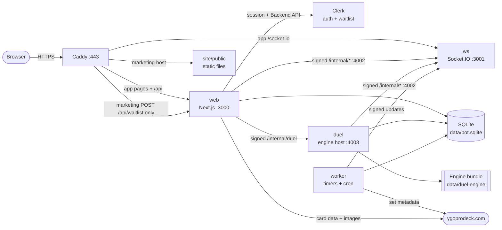
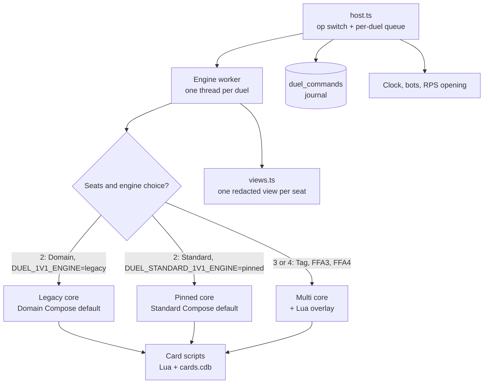
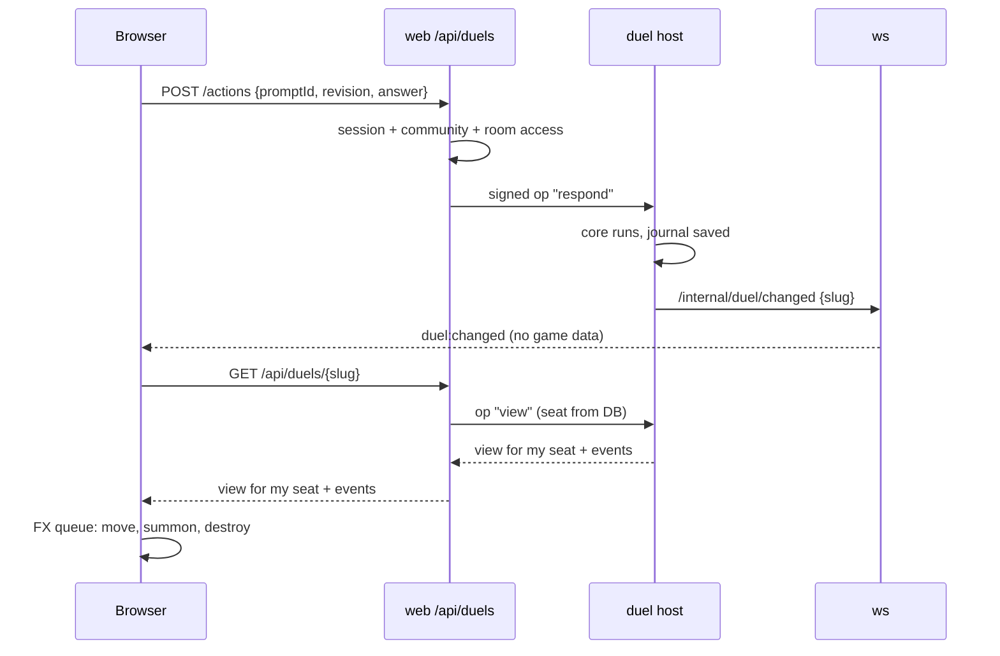
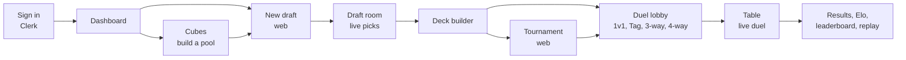

# Architecture

A short map of the system. The code is the source of truth; this page tells you where to look.

## 1. The platform

| Box | Job | Code |
|---|---|---|
| web | Pages, API routes, custom Clerk sign-in | `packages/web` |
| ws | Live pushes only. Never carries hidden game data | `packages/ws` |
| bot | Shelved commands/Discord effects; no Compose service | `packages/bot` |
| duel | Runs the rules engine. Private, internal port only | `packages/duel-server` |
| worker | Draft expiry, report approval, tournament deadlines, set sync, image eviction | `packages/worker` |
| e2e | Isolated web/WS/duel/worker with offline signed-cookie login | `packages/e2e` |
| shared | DB schema and all business services | `packages/shared` |

There are seven packages. Run `npm run dev:worker` alongside web/WS/duel and `npm test --workspace=packages/worker` after building shared. Exactly one worker uses each SQLite file. Startup sweeps catch durable deadlines; SIGTERM drains in-flight work. The bot is shelved outside Compose/deploy, behind literal `DISCORD_BOT_ENABLED=1` on both entrypoints; it owns none of the four migrated schedulers. The duel host retains its engine clocks and archive/series sweeps.

`users.id` is application identity, `players.user_id` links to it, and gameplay player IDs stay unchanged. Owners/creators are integer user IDs; `session.user.id` is their decimal string and `session.user.discordUserId` is nullable. Clerk sessions resolve through one server resolver, syncing missing/stale/forced profiles and linking verified Discord identities transactionally. Email-only users work without Discord checks. Draft tokens use application IDs; duel tokens still use player IDs. Creators manage their resources; no admin role remains. Seasons/imports/merges use `node packages/worker/dist/ops/cli.js` on the VM.

All DB consumers use the same absolute `DATABASE_PATH`. `openDatabase` enables WAL, a 5000-ms busy timeout and foreign keys. Worker/web share an absolute image-cache path; worker publishes committed WS state with Discord effects disabled. The worker has no public port and uses a local heartbeat healthcheck. E2E supervises four processes per isolated DB/cache/heartbeat, authenticating offline with an expiring HMAC-signed `dd_e2e_session` cookie (literal `E2E_AUTH=1` and ≥32-character secret only).

All internal calls are HMAC-signed POSTs (`shared/src/notify/signed-post.ts`). Ports 4002 and 4003 are never public; the shelved bot target retains private port 4001.

`SITE_DOMAIN` is the app host (production `app.duelingdomain.com`, marketing `duelingdomain.com`, legacy `duelistskingdom.com`); `WEB_URL` is its required canonical origin and WS CORS origin. Optional `MARKETING_DOMAIN` serves static files, redirects `/login` to the app, and permits only the exact waitlist POST upstream; its `www` redirects to the marketing apex. `LEGACY_DOMAIN` and its `www` preserve paths/queries in a 308 to the app. Unset extra domains use reserved `.localhost` defaults, leaving existing public routing unchanged. Exact `POST /api/waitlist` stores normalized emails locally then creates Clerk waitlist entries with notification; retryable Clerk failure returns 503 `retry_later` (native form redirects to the retry outcome) and retains the local row. Owner reconciliation handles existing signups. Exact `GET /api/auth/session` returns 200 `null` anonymously. Custom `/sign-in`, `/sign-up`, `/sso-callback`, `/access`, legacy `/login`, assets/icons and enabled FX-lab paths are public; test-auth routes require the isolated E2E gate. Legal links point to marketing `/privacy` and `/terms`. See [domains](deployment/domains.md).

Compose runs web/WS/duel/worker/Caddy, fixes `DISCORD_BOT_ENABLED=0`, and injects only explicit web env variables. Disabled channel/announce routes return 404 `discord_disabled`; gameplay commits and WS updates continue. `NEXT_PUBLIC_CLERK_PUBLISHABLE_KEY` goes only to the web build/dev process, `CLERK_SECRET_KEY` only to web runtime or explicitly authorized one-off owner CLI runs. Production/staging never use dev keys.

## 2. The duel engine

**One action, start to end**

1. The host checks the `promptId` and `revision`. A stale answer gets 409.
2. The worker feeds the answer to the WASM core.
3. The host appends the command to the journal in SQLite.
4. The host builds a view for each seat. Hidden cards are removed.

**Cores.** Each core has a Standard and a Domain (Deck Master) build.

| Core | Used for | File |
|---|---|---|
| Legacy | Domain 1v1 Compose default (`DUEL_1V1_ENGINE=legacy`); Standard with `DUEL_STANDARD_1V1_ENGINE=legacy` | npm `ocgcore-wasm`, `ocgcore.domain.legacy.wasm` |
| Pinned | Standard 1v1 Compose default (`DUEL_STANDARD_1V1_ENGINE=pinned`); Domain with `DUEL_1V1_ENGINE=pinned` | `ocgcore.standard.wasm`, `ocgcore.domain.wasm` |
| Multi | Tag, 3-way, 4-way | `ocgcore.multi.wasm`, `ocgcore.multi-domain.wasm` |

Native runs with a missing, empty or invalid Standard override use `DUEL_1V1_ENGINE` (default `legacy`).
Compose uses `pinned` for a missing or empty Standard value. Each game of a series reads the switch at its start;
recover and replay keep that game's saved engine. See [the engine switch](deployment/duel-engine-switch.md).

**Engine data.** `scripts/prepare-data.ts` pins the card DB (BabelCDB), strings and Lua scripts (ProjectIgnis CardScripts). `manifest.json` holds the hashes and the `bundleVersion`. The server checks the bundle at start.

**Restart safety.** Live state is in worker memory. SQLite keeps the seed and the command journal. `recover()` replays the journal on a fresh worker. A replay needs the same `bundleVersion`.

## 3. Engine to screen

- The socket only says "something changed". The browser then asks for its own view.
- The seat always comes from the DB. A client cannot act for another seat.
- If the socket is down, the page polls (1 s offline, 10 s live).
- A 5-minute signed token (`/connection`) lets a tab join the duel room.
- FX: `event-queue.ts` → `effect-sequence.ts` → `MoveFx`, `SummonFx`, `DestroyFx`.

## 4. What we added for Tag, 3-way and 4-way

| Layer | Added | Where |
|---|---|---|
| Core | ~91 patches: seat arrays, teams, elimination, team LP, opponent binding, FFA attack rules, clockwise chain order, leaving | `duel-server/domain-core/patches/` |
| Core | Domain multi core: Deck Master for 3 and 4 seats | `build-multi-core.sh`, `apply-domain-multi.mjs` |
| Core | FFA4: across seats (0+2, 1+3) share Extra Monster Zones and columns | patch 0077 |
| Scripts | Lua overlay: ~580 card fixes + `mp-utility.lua`. 1v1 never loads it | `domain-core/multi-scripts/` |
| Host | Formats, seat counts, teams, opponents | `shared/src/duels/settings.ts` |
| Host | Seat lobby, practice bots, ready, start | `shared/src/services/duels.ts` |
| Host | Attack-target pick, surrender, timeouts, autopilot for out seats | `attack-target-pick.ts`, `host.ts` |
| Host | Flag `MULTIPLAYER_TABLES` (Compose: on) | `shared/src/duels/multiplayer-tables.ts` |
| Rules | Rule list and tests | `docs/adr/0002`, `docs/specs/multiplayer-rule-coverage.md` |
| UI | 3-way and 4-way: Plaza table, aim arrow, seat crumble | `web/src/components/duel/table/` |
| UI | Tag 2v2: Rooftop, shared team LP | `web/src/components/duel/tag/` |

Not on main yet: the 4-way 2x2 grid UI, and PR #178, which changes the FFA4 shared zones from across seats (0+2, 1+3, patch 0077) to facing seats (0+1, 2+3).

## 5. How a player uses the site

## More

- Rules for multiplayer: [ADR 0002](adr/0002-multiplayer-duel-rules.md). Test layers: [ADR 0003](adr/0003-duel-test-layers.md).
- Draft dealing: [draft-engine.md](draft-engine.md). Core ABI: [engine/ocgcore-wasm-abi.md](engine/ocgcore-wasm-abi.md).
- Deploy and ops: [deployment/vm-runbook.md](deployment/vm-runbook.md), [deployment/duel-engine-switch.md](deployment/duel-engine-switch.md).
- Weekly card data updates: [deployment/engine-data-updates.md](deployment/engine-data-updates.md).

## Card artwork selection

The duel server owns selectable artwork identity: only passcodes in its `cards.cdb` artwork alias family may enter a deck picker. The authenticated web artwork route merges that family with `card_artworks` API metadata and the existing image cache, returning only local cached-image route URLs (nullable when availability is unknown). Search stays one result per card and includes `altArtCount`. Deck storage preserves selected engine passcodes; draft-pool checks canonicalize both sides without rewriting the art choice. Explicit cube rows can swap same-family artwork while retaining copy counts.

See [the picker backend contract](specs/alt-art-picker.md) for exact routes, types, alias edge cases, and the resumable `npm run backfill:artworks --workspace=packages/shared -- --database … --dump … --state …` maintenance command. The backfill downloads one full metadata dump, syncs existing catalog families, and does not fetch images. It must be run explicitly; no production backfill is part of this implementation.
