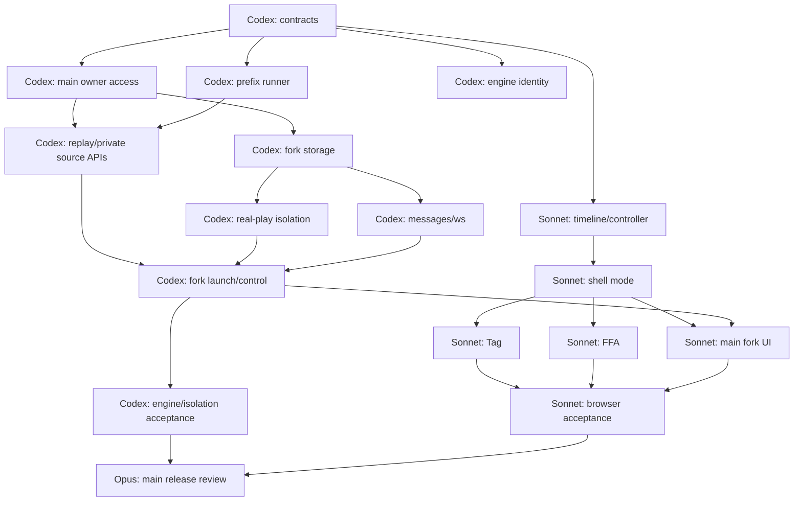

# Dueling Domain: all-seat replay and replay fork

Coordinator decisions

1. Jump-in points use stable engine checkpoints only. No mid-animation stops.
2. Old games use current resources only. Record EngineIdentity for new games (B5 identity only). No archive retention in this release. A resource mismatch returns ENGINE_UNAVAILABLE_FOR_SOURCE; show the saved final board with a clear reason.
3. In a fork, Reveal hands and Follow prompt are ON by default, with a Follow prompt toggle. Apply “Ask at all response windows” to all living seats by default after jump-in, as journaled commands after the prefix. Never change the prefix.
4. No journal file import in this release. Fork database duels by slug.

These decisions replace the open recommendations in section 12.


Date: 2026-10-10. Status: design revised for the owner decision of 2026-10-10. No code changes.

## 1. Scope and recommendation

Put the multi-seat replay viewer and “Jump in here” on main, the live site. All users who can see a duel can use its replay viewer. Keep their current card visibility rules.

Limit Jump in to the owner and approved developers on main. Use `isOwnerUser()` from `packages/web/src/lib/owner-access.ts` and `OWNER_USER_IDS`. Normal alpha users must not see the controls or call the routes. This decision is fixed. Do not ask for branch approval again.

The owner wants to select a replay point and play as all players. A real duel supplies the field, effects and chains. This is more useful to the owner than a new sandbox board. The owner can use real production duels, including duels named in bug reports.

Create a new private duel with `kind: "replay-fork"`. Copy the exact journal prefix. Start a new engine with the original seed, decks, rules, engine and scripts. All seats use Manual control. The source duel stays unchanged. The fork must not affect stats, scoring, series, tournaments or matchmaking. It must not send messages or invites to source players.

Use main as the implementation base. Sandbox code can supply ideas. No task depends on `feat/dev-sandbox-main` or its deployment.

The remaining choices are in section 12. These engine limits apply:

- A point is a stable engine state after saved input. The current API cannot stop inside an engine process call or an animation.
- Old journals need their exact engine resources and runtime rules. A new viewer alone cannot restore them.

Backend work: Codex. UI work: Sonnet. Integration review: the owner's Opus worker. The task list is for later implementation. This revision changes only this design file.

## 2. Source and evidence rules

The first investigation completed `git fetch -q origin`. Its source reads used `git show` or `git grep` on remote refs. No worktree or branch was created. No server was started. No port or process was changed.

These are the source commits:

| Label | Ref | Commit |
| --- | --- | --- |
| M | `origin/main` | `75db2ab5a948b1e43ff574bae1c2766221b7cd4b` |
| S | `origin/feat/dev-sandbox-main` | `b3a98e44e9e90b7368fb40b5e8264343e984a3f1` |

Each `M:path:line` or `S:path:line` below names that commit. Lines do not refer to the current working tree. Immutable source roots are [main](https://github.com/DuelingDomain/yugioh-bot/tree/75db2ab5a948b1e43ff574bae1c2766221b7cd4b) and [sandbox](https://github.com/DuelingDomain/yugioh-bot/tree/b3a98e44e9e90b7368fb40b5e8264343e984a3f1).

The branches have a large gap. Main has 698 commits absent from S. S has 81 commits absent from main. Their common base is `0450da0dea61585bf1addcb0b7cdbba94c11f790`. Build both features from main. Read sandbox code only as a reference. Do not merge that branch or require it for fork work.

This report uses source evidence. It does not claim that runtime tests passed. No tests, builds, data preparation, or live database reads were run.

The revision read the same saved refs. It did not fetch, create a branch, start a process or change repository files. The checks below describe future code changes and tests.

## 3. Current replay system on main

### 3.1 Entry points and engine re-run

The page passes the slug to `DuelReplayView`. The GET API checks the signed-in actor and room access. It calls the private host with `op: "replay"`.

Evidence: `M:packages/web/app/(app)/duels/[slug]/replay/page.tsx:1`; `M:packages/web/app/api/duels/[slug]/replay/route.ts:6`.

The host requires a completed or interrupted duel. It reads private state. It starts a temporary engine with the saved decks, seed, settings, format and setup. It reads the opening view. Then it applies each saved command in order. Before each command, it checks the engine revision. For a normal answer, it also checks the prompt ID. It reads the viewer's board after each command. It closes the temporary engine at the end.

Evidence: `M:packages/duel-server/src/host.ts:1434`, `:1461`, `:1471`, `:1501`.

Thus, a replay is an engine re-run of saved input. It is not playback of a saved engine message stream. Log lines and events are rebuilt by the engine. The returned frames have full boards and only the new log lines and events. The client builds a timeline and a cumulative window of up to 400 entries.

Evidence: `M:packages/duel-server/src/host.ts:1424`; `M:packages/web/src/components/duel/replay-timeline.ts:3`, `:22`.

Commands include answers, `chain-mode:<mode>`, and `eliminate:<reason>`. An elimination or mode change has no normal prompt. It still needs the recorded revision. A mode change with no revision change has no visible frame. Frame numbers therefore do not equal journal command numbers. If the re-run has no engine result, the host adds a saved final board or a synthetic result frame.

Evidence: `M:packages/duel-server/src/journal-command.ts:8`, `:13`; `M:packages/duel-server/src/host.ts:1475`, `:1491`, `:1504`.

The host caches up to 16 replay results. The cache key includes guild, slug and viewer seat or public view. A replay worker has no normal script-error database recorder. This prevents an ordinary replay from adding live error occurrences.

Evidence: `M:packages/duel-server/src/host.ts:102`, `:362`, `:1457`, `:1525`.

### 3.2 Data stored for each duel

| Stored data | Purpose | Evidence |
| --- | --- | --- |
| Duel ID, slug, guild, organizer, mode, master rule, format, settings, status, result and dates | Table identity and rules | `M:packages/shared/src/db/schema.ts:856`, `:910` |
| Four seed words as decimal strings; bundle version | Engine creation and version check | `M:packages/shared/src/db/schema.ts:865` |
| Ordered seat rows; player or bot identity; ready state; full deck JSON | Seat order and original game decks | `M:packages/shared/src/db/schema.ts:879` |
| Ordered `duel_commands`: sequence, seat, command JSON and date | Accepted input journal | `M:packages/shared/src/db/schema.ts:891`; `M:packages/shared/src/services/duels.ts:563`, `:1111` |
| `setup_json` | Startup Lua text, saved engine choice, first-turn draw rule, script error mode, and scenario/bot/loss metadata | `M:packages/shared/src/services/duels.ts:97`; `M:packages/shared/src/db/schema.ts:916` |
| `clock_json` and opening data | Live timing and pre-game choices | `M:packages/shared/src/services/duels.ts:1100`, `:1360` |
| Public final snapshot; old seat 0/1 snapshots; multi-seat snapshot array | Final board after engine disposal | `M:packages/shared/src/db/schema.ts:874`, `:915`; `M:packages/shared/src/services/duels.ts:1166` |
| Series ID, game number, best-of and ranked status | Link to the match | `M:packages/shared/src/services/duels.ts:722` |

`DuelCommand` contains `promptId`, `revision` and `answer`. Some host commands also have a diagnostic note. `privateState()` returns decks in seat order and commands in sequence order. It does not return sequence IDs today. A prefix service needs to add them or define the ordered count explicitly.

Evidence: `M:packages/shared/src/duels/index.ts:625`; `M:packages/shared/src/services/duels.ts:563`, `:1370`; `M:packages/duel-server/src/host.ts:1770`.

A host report can also write `journal.jsonl`. Its header contains format, settings, seed, decks, setup, startup script text and diagnostic WASM identity. This is a separate report artifact. Those WASM hashes are not part of the normal `DuelPrivateState` contract.

Evidence: `M:packages/duel-server/src/host.ts:1724`, `:1742`, `:1750`, `:1809`; `M:packages/shared/src/services/duels.ts:118`.

### 3.3 Format support and failures

| Format | Host replay today | Viewer today |
| --- | --- | --- |
| 1v1 | Re-runs the saved legacy or pinned engine | Correct basic two-seat layout; no perspective selector |
| Tag, 2v2 | Passes four decks and `format: "tag"`; uses the multi core | Uses the 1v1 field. Two seats are omitted. No Rooftop. Winner text names one player rather than the team |
| FFA3 | Passes three decks and `format: "ffa3"`; uses the multi core | Uses the 1v1 field. One seat is omitted. No plaza or full loss order |
| FFA4 | Passes four decks and `format: "ffa4"`; uses the multi core | Uses the 1v1 field. Two seats are omitted. No 2x2 grid or full loss order |

There is no format refusal in `buildReplay()`. The main UI always prints “1v1”. It always mounts `DuelField`. That field selects only a bottom and a top seat. For seats 2 or 3, the caption's “first other seat” can also differ from the top field selected by `DuelField`. Hidden data can exist in the response for the proper seat while its board is absent from the screen.

Evidence: `M:packages/duel-server/src/host.ts:1434`, `:1461`; `M:packages/web/src/components/duel/replay.tsx:192`, `:205`, `:249`, `:267`; `M:packages/web/src/components/duel/field-model.ts:48`.

The live room already uses `TagShell` for Tag and `TableShell` for FFA. These are the UI parts to reuse. The FFA shell selects the grid where the shared Extra Monster Zone data fits its layout.

Evidence: `M:packages/web/src/components/duel/room.tsx:203`, `:991`; `M:packages/web/src/components/duel/table/table-shell.tsx:199`, `:228`; `M:packages/web/src/components/duel/table/grid-layout.ts:60`.

These refusals apply today:

- Active or cancelled source duel: no replay. Only completed or interrupted is accepted.
- Missing seed or bundle version: no recorded replay.
- Bundle mismatch: HTTP 409. Final board remains available.
- Revision or prompt mismatch: HTTP 409. The partial replay is not returned.
- Missing core or worker failure: engine availability error, generally HTTP 503.
- Old FFA record without `firstTurnDraw`: its rule is unknown, so replay and recovery are refused.
- Retired `eliminate-eot:<reason>`: the current engine refuses this surrender rule.

Evidence: `M:packages/duel-server/src/host.ts:1436`, `:1440`, `:1443`, `:1451`, `:1453`; `M:packages/duel-server/src/first-turn-draw.ts:18`; `M:packages/duel-server/src/engine.ts:1274`.

### 3.4 Private data and perspective

The service gives a player their database seat. A spectator gets `mySeat: null`. The replay API has no requested seat parameter. The host builds all frames for this one viewer. There is no current replay seat switch.

Evidence: `M:packages/shared/src/services/duels.ts:1340`; `M:packages/web/app/api/duels/[slug]/replay/route.ts:17`; `M:packages/duel-server/src/host.ts:1450`, `:1526`.

The engine projects hidden information on the server. A seat sees its own hand and Extra Deck. A spectator sees public information. Tag partners can see each other's hands and Set field cards. A partner does not automatically see the other partner's face-down Extra Deck. Deck order is hidden. Face-down banished cards follow their own visibility rule. Effects can reveal more cards to specific viewers.

Evidence: `M:packages/duel-server/src/views.ts:157`, `:183`, `:261`, `:1541`.

Logs and events also have audiences. Do not use one seat's log for every seat. A normal view exposes the answering seat's prompt only according to the prompt projection. `prioritySeat` identifies who must answer without exposing options. Replay output clears prompt, priority and private chain mode today.

Evidence: `M:packages/duel-server/src/views.ts:720`, `:1657`, `:1677`; `M:packages/shared/src/duels/index.ts:513`; `M:packages/duel-server/src/host.ts:1431`.

### 3.5 Engines, bundles and old replays

For 1v1, `setup.engine` preserves `legacy` or `pinned`. The current environment switch does not select a replay's engine. An old record without this field uses legacy. An old record with startup scripts uses pinned as the fallback. Multi-seat formats ignore this choice and use the multi core for their mode.

Evidence: `M:packages/duel-server/src/host.ts:469`, `:479`; `M:packages/duel-server/src/worker.ts:75`.

| Engine and mode | Required core or path |
| --- | --- |
| Legacy 1v1 Normal | npm `ocgcore-wasm` legacy core and compatibility scripts |
| Legacy 1v1 Domain | `ocgcore.domain.legacy.wasm` and `domain.legacy.lua` |
| Pinned 1v1 Normal | `ocgcore.standard.wasm` |
| Pinned 1v1 Domain | Domain factory and pinned Domain core/script |
| Tag/FFA Normal | `ocgcore.multi.wasm` and multi Lua overlay |
| Tag/FFA Domain | `ocgcore.multi-domain.wasm`, Domain Lua and multi Lua overlay |

Evidence: `M:packages/duel-server/src/legacy/engine.ts:66`, `:69`, `:237`, `:295`; `M:packages/duel-server/src/engine.ts:98`, `:118`, `:431`, `:480`.

For two seats, the saved version is the manifest bundle version. For more than two, it is a hash of the bundle version and the active multi-scripts hash. A multi overlay edit can therefore invalidate only multi-seat duels. Development can load the repo overlay instead of the data directory copy. Production uses the bundled copy.

Evidence: `M:packages/duel-server/src/host.ts:332`; `M:packages/duel-server/src/multi-scripts.ts:63`, `:115`, `:129`.

Correction to the reported symptom: an active duel becomes interrupted when recovery finds a version mismatch. A completed old duel does not change status merely because replay is requested. Its replay GET fails with 409. The replay test checks this distinction. An interrupt can exist without a final board if no snapshot was captured.

Evidence: `M:packages/duel-server/src/host.ts:1132`, `:1443`; `M:packages/duel-server/tests/host.test.ts:1252`; `M:packages/shared/src/services/duels.ts:1166`.

`bundleVersion` is a compatibility check, not an engine archive. A resource version also does not identify all historical host rules. The first-turn draw rule is a known example. Save explicit rules and complete engine identity for new games. Do not remove the mismatch check to make old games appear to work.

Evidence: `M:packages/duel-server/src/first-turn-draw.ts:12`; `M:packages/duel-server/src/engine-bundle.ts:34`.

## 4. Recovery and the fork mechanism

### 4.1 What can be reused

Recovery already starts a new worker from the original seed and decks. It applies the full command journal with the same revision and prompt checks as replay. This applies to all four formats. The replay command helper already dispatches normal answers, mode changes and losses.

Evidence: `M:packages/duel-server/src/host.ts:1121`, `:1148`, `:1165`; `M:packages/duel-server/src/journal-command.ts:13`.

Yes: the same engine procedure can stop after the first N journal commands. It can then continue with new answers. This preserves Lua effects, chains, counters, summon limits, Deck Master state and the advanced RNG state. It does not need a raw engine memory snapshot.

This is a design inference from recovery. The host has no fork operation today. `recover()` itself is not the correct entry point. It requires an active source, runs the full journal, registers the worker under the source slug, and drives bots. It can also interrupt the source on a mismatch.

Evidence: `M:packages/duel-server/src/host.ts:1130`, `:1200`, `:1207`, `:1216`.

The command-line replayer already has `--stop-at N`. Its engine selection respects `setup.engine`. The separate `replaySource()` helper can also stop at N, but always calls the merged engine. It closes the engine before returning and lacks the full host compatibility contract. Do not use it unchanged for a legacy fork.

Evidence: `M:packages/duel-server/scripts/replay-journal.ts:95`, `:132`; `M:packages/duel-server/scripts/lib/replay-source.ts:114`, `:142`, `:175`.

### 4.2 Required prefix procedure

Extract an engine-only runner shared by recovery and replay. It receives validated source state, a selected resource directory, an ordered prefix count and a worker. It has no database status changes, bot actions, clock actions or notifications.

1. Resolve the source engine and exact rules. Check the bundle before creating a worker.
2. Create the engine with original decks in original seat order. Use all four original seed words.
3. Load original startup script text in original order. Load the matching Domain and multi scripts.
4. For each command through N, read its seat view and check revision. Check the prompt ID for an ordinary answer.
5. Apply the command. Include private mode changes and loss commands. Never use only visible replay frame numbers.
6. Read the resulting public and seat views. Check the target revision and a state digest where available.
7. Return the paused worker. Do not drive bots or settle clocks.

The runner must use the saved `firstTurnDraw` and `scriptErrorMode`. Old records use the existing safe fallback rules. It must not use today's card admission bans to rewrite the old decks. A replay reproduces the accepted original inputs.

Seed validation requires four nonzero decimal uint64 words. A fork must not generate a new seed, shuffle a new deck, or replay the opening dice/RPS. Opening seat choices are already reflected in the saved decks and seats.

Evidence: `M:packages/duel-server/src/engine.ts:267`, `:469`, `:502`; `M:packages/duel-server/src/host.ts:436`, `:484`.

### 4.3 New duel persistence and safe handoff

Use a dedicated main fork path. Add `duels.kind` with values `play` and `replay-fork`. Default old rows to `play`. The server sets the kind at insert time. It is immutable. Do not accept it from a normal create request.

Store private fork data in `setup_json.replayFork`: creator `ownerUserId`, origin, copied prefix count/hash and `control: "all-manual"`. `DuelSession.kind` carries the mark to the host, web and UI. Use one `isReplayFork()` helper. Reject unknown kinds or inconsistent kind/setup data. `setSetup()` must preserve the mark and creator data. Do not infer the kind from the name, bot seats, `ranked: false` or `visibility: private`.

Set `bestOf: 1`, `ranked: false`, private visibility, `series_id: null`, `game_number: null`, no tournament or match link, `clock_json: null`, `opening_json: null` and `invite_code: null`. Create no invite grants. Keep the source game rules separately from disabled live timers. Seat 0 belongs to the fork creator. Other seats use bot rows only as storage, with no real player IDs and no bot policy. All seats are Manual. Source names are display metadata only. The database permits one row per player per duel.

Evidence: `M:packages/shared/src/db/schema.ts:887`. Main has no sandbox exclusion today. Its `activateTx` calls `series.onActivate` at `M:packages/shared/src/services/duels.ts:1105`. Its `finalizeTx` calls `series.onGameFinished` at `:1201`. Add explicit fork guards. `ranked: false` alone is insufficient.

Re-run and validate the prefix in a detached worker. Then insert the new duel, exact decks, seed, version, rules, fork setup and copied commands in one transaction. Insert it as active through the dedicated fork service. Do not call normal lobby creation, opening or start. Only register the validated worker after commit. The source is read-only. A transaction failure closes the worker. A registration failure cancels only the new fork. A host crash after commit permits recovery from the copied journal.

Add a `replay_fork_requests` table. Its unique key is `(owner_user_id, request_id)`. Save source slug/version, cursor digest and new fork ID in the same transaction. The source slug has no foreign key to the source row. Concurrent retries return one fork. A different source, version or cursor with the same key fails. Recheck creator access before returning a saved retry. Never leave an unmarked staging duel in a normal list or sweep.

Copy the prefix into the fork's own `duel_commands`. New answers append after it. Recovery does not need the source row. Restart rebuilds that copied prefix and removes only later fork answers. It must not use scenario-board restart.

Prefix playback has no database errors, bot notes, clocks or notifications. After handoff, script errors can belong to the fork. Mark those diagnostics as fork data. Keep them out of production error counts and automatic card blocking. Preserve the source script-error mode.

Derive losses from commands through the selected prefix. Do not copy the source's final `surrenderedSeats` into an earlier point. Keep pending loss separate from elimination. The owner must answer a required prompt from a pending-loss seat. An old host-only loss with no known sequence can make a target unsafe; refuse that target.

Some terminal events are host results, not engine commands. A synthetic final board cannot be resumed. Offer the preceding valid engine state with its own cursor. A genuine engine result also cannot be resumed.

Evidence: `M:packages/duel-server/src/host.ts:1270`, `:1281`, `:1504`, `:1758`.

### 4.4 Series games

Select the exact source game by duel slug. Copy that game's saved seat order and decks. Do not use the series' current decks. Later games can use side decks and a different first seat. Each game start gets its own random seed and engine selection.

Evidence: `M:packages/shared/src/services/duel-series.ts:1105`, `:1118`, `:1122`, `:1156`; `M:packages/duel-server/src/host.ts:2074`.

The fork must not update series wins, start the next game, submit a ranked result, or alter tournament state. A normal 1v1 activation can create a series even for best-of-one human games. Use the new main fork activation path and the mark checks in section 9.2. Do not call the sandbox branch.

Evidence: `M:packages/shared/src/services/duel-series.ts:471`, `:506`, `:585`; `S:packages/shared/src/services/duels.ts:1184`.

## 5. Sandbox code as a reference

These parts exist on the sandbox branch. Main must implement or port only the required parts.

| Reference | Use on main | Required limit |
| --- | --- | --- |
| `resolveActingSeat()` and Manual seats | Let the fork creator act as every seat | Require main owner access and the fork mark; ordinary duels reject `as` |
| `policiesForRun()` | Exclude Manual seats from bot actions | Keep all-seat Manual control after recovery and reconnect |
| Room/API `as` option | Send views and answers for the selected seat | Bind answers to the seat, prompt ID and revision |
| Follow prompt | Select the seat at `prioritySeat` | Keep manual switching; prevent races |
| Reveal hands | Show hands and Extra Decks in the private fork | This does not reveal every Set card or private log |
| Toolbar and resource limits | Show origin, restart and seat controls | No board phase-walk or bot controls in an exact fork |

Evidence: `S:packages/duel-server/src/sandbox-seats.ts:31`, `:56`, `:75`; `S:packages/duel-server/src/host.ts:429`, `:1292`, `:2434`, `:2657`; `S:packages/web/src/components/duel/sandbox-bar.tsx:188`, `:319`, `:345`.

The reference Follow prompt default is off. Reveal hands defaults to on. Recommend these defaults for the private fork. All seats start Manual.

Do not port `canUseSandbox()`, `SANDBOX_DISCORD_IDS` or the dev deployment gate. They are not main access rules. Main uses `isOwnerUser()` and `OWNER_USER_IDS`. It has no separate admin role or automatic alpha-user access.

Evidence: `M:packages/web/src/lib/owner-access.ts:1`; `M:packages/web/app/api/admin/access/route.ts:17`. The IDs are application `users.id` values. An empty list allows nobody.

Scenario start adds opening and phase-window scripts and selects pinned for 1v1. A board snapshot loses lasting effects, used effects, turn count, chains, counters and the current prompt. Do not use either path for an exact fork. Main needs a dedicated journal-prefix launch path. Keep the recorded engine, even for a legacy duel.

Evidence: `S:packages/duel-server/src/sandbox.ts:74`, `:111`; `S:packages/duel-server/src/sandbox-snapshot.ts:53`, `:64`, `:77`, `:85`, `:101`, `:153`.

The fork setup is independent of `SandboxSetup`, `SandboxBoard` and `SandboxRun`. Save-state export as an approximate board can be a later feature. It is not required for Jump in.

## 6. Alternatives

| Approach | Benefit | Cost or failure | Decision |
| --- | --- | --- | --- |
| New worker plus exact journal prefix | Reuses proven recovery; preserves engine and Lua state | Work grows with prefix length; needs exact resources | Recommended |
| Convert replay board to a sandbox scenario | Simple board import | Loses effects, prompt, RNG position and chain state | Fails the exact-point requirement |
| Serialize engine memory at each step | Potential fast random access | No current snapshot/restore contract; includes WASM, Lua and host state | Separate research; not needed for first delivery |

A saved message log can preserve a viewer display. It cannot resume the engine by itself. If durable replay frames are added later, keep the journal and resources for forks.

## 7. Proposed replay viewer on main

### 7.1 Step model

Use a versioned replay contract. A visible step is a stable engine state. Step 0 is the opening engine state. Later steps are captured after commands that produce a visible frame. Each frame has a stable `frameId`, a kind, an opaque engine cursor where valid, and a read-only view.

Keep the internal journal count separate from the public step. Private no-op mode changes stay in the runner but do not add public steps. A frame cursor names the exact prefix used when that frame was captured. Commands skipped after that frame belong to a later prefix. Do not treat `revision` as a command count: multiple commands can share it.

All perspectives use the same visible frame IDs. Each perspective has its own delta log and event data. Never reuse delta cursors from another perspective.

The result frame has `kind: "result"` and `cursor: null`. A genuine engine result also disables jump-in. Keep the preceding playable frame available. An interrupted duel can have a valid prefix, but only offer a fork where the prefix can be reproduced safely.

During seek or a seat switch, cancel pending animation queues. Render the target state directly. Play new events only during forward playback. A transient animation frame has no new engine cursor. Pressing Jump in pauses playback and uses the selected engine frame.

Do not advertise “any animation instant”. If the owner requires a stop between each engine message, add an engine stepping API and a larger design phase.

### 7.2 Perspective and hidden information

Keep camera position separate from card visibility:

- **View from seat** changes the board position. All seats can be selected, including eliminated seats.
- **Public / My cards** selects the server view. Ordinary users get public data or their own cards only.
- **Private seat view / Reveal hands / Jump in** is available on main only with current owner access.

Every user who can see the duel can use the multi-seat viewer. Camera switching does not grant another player's cards. Do not send all private views to an alpha browser and hide them with CSS.

For an allowed owner or developer, use a separate privileged source read. It can read a real production duel in the configured guild even if that actor was not a source player or invitee. This supports private bug reports. Check `isOwnerUser()` before source lookup. Check guild and source identity on the host. This privileged path reads `play` sources. A `replay-fork` source still needs current creator access. Do not create an invite grant, change source visibility or notify source players. This is a narrow diagnostic right. Ordinary replay access stays unchanged.

Load private source views one seat at a time. Fork ownership grants all-seat control only in the new fork. It does not permit the owner to answer for another player in the real duel.

Keep the selected step, speed and pause state across camera changes. Reset inspector, pile and animation state when card visibility changes. Include source version and visibility in request/cache keys. Ignore late responses for an old view. Private responses use `Cache-Control: private, no-store`.

### 7.3 Layouts and log

| Format | Layout | Replay behavior |
| --- | --- | --- |
| 1v1 | Existing `DuelField` | Two seats; passive field; perspective anchor independent of private viewer |
| Tag | Rooftop through `TagShell` / `TagStage` | Four fields; teams 0+2 and 1+3; team LP once; correct shared Extra Monster Zones; team result |
| FFA3 | `TableShell` / `TableStage`, plaza | All three fields and individual LP; turn owner; pending losses and loss order |
| FFA4 | `TableShell` / `GridStage`, 2x2 | All four fields; facing pairs 0+1 and 2+3 share Extra Monster Zones; individual LP; historical losses |

Tag teams are different from facing Extra Monster Zone pairs. Use shared seat helpers and engine metadata. Do not group Tag teams by adjacent seat numbers. Do not call FFA facing seats teammates.

Evidence: `M:packages/shared/src/duels/settings.ts:29`, `:55`, `:61`; `M:packages/web/src/components/duel/table/grid-layout.ts:39`; `M:packages/web/src/components/duel/table/plaza.tsx:10`.

Add a replay mode to the shared shells. Supply a read-only `TableController`: `prompt: null`, `canAct: false`, no legal or selected keys, no seat pick, no answer callback effect. Replace live phase actions with replay controls. Suppress live result overlays, series continuation, clocks, surrender, and connection prompts. Keep camera controls, inspection and Deck Master display.

Evidence for the existing boundary: `M:packages/web/src/components/duel/table/types.ts:145`; `M:packages/web/src/components/duel/table/table-shell.tsx:85`; `M:packages/web/src/components/duel/tag/tag-shell.tsx:52`.

The log uses the selected data perspective, not the camera seat. Show player names, team names where needed, turn and phase, and the actor for the selected frame. Preserve public/private audience rules and log/event IDs. Keep the current 400-entry display window. Add optional earlier-log paging later if full text history is required. The source journal remains the complete input history.

Use one transport bar in all layouts: first, previous, play/pause, next, last, step slider and speed. Keep the full table readable on narrow screens through the existing table cameras and panels. Keyboard controls must not consume input inside dialogs or fields.

### 7.4 Proposed shared contracts

These types are proposals. They are not current API fields.

```ts
type ReplayVisibility = "public" | "mine";
type ReplayCursor = string; // opaque; must not expose private journal counts

interface ReplayFrameV2 {
  frameId: string;
  step: number;                 // visible step only
  kind: "opening" | "engine" | "result";
  actorSeat: number | null;
  cursor: ReplayCursor | null;  // checkpoint identity, not permission
  view: DuelEngineView;         // prompt/chainMode cleared; delta log/events
}

interface DuelReplayV2 {
  version: 2;
  sourceVersion: string;
  session: DuelSession;
  role: DuelActorRole;
  mySeat: number | null;        // authenticated source seat
  dataSeat: number | null;      // actual server projection
  frames: ReplayFrameV2[];
  capabilities?: ReplayOwnerCapabilities; // present only after the main owner check
}

interface ReplayOwnerCapabilities {
  canFork: boolean;
  privateSeats: number[];
}

// New DuelSession field: kind: "play" | "replay-fork".
// New DuelSetup field, private and required for kind "replay-fork":
interface ReplayForkSetup {
  ownerUserId: number;
  control: "all-manual";
  origin: ForkOrigin;
}

interface ReplayForkRequest {
  cursor: ReplayCursor;
  sourceVersion: string;
  requestId: string;            // retry key, bounded and validated
}

// Optional DuelRoom.fork, returned only to the authorized fork creator.
interface ReplayForkControl {
  identitySeat: 0;
  actingSeat: number;
  manualSeats: number[];
}

interface ReplayForkResult {
  slug: string;
  sourceFrameId: string;
  initialSeat: number;
  room: DuelRoom;               // acting-seat view plus fork control; mySeat stays 0
}

interface ForkOrigin {         // private persisted metadata
  sourceSlug: string;
  sourceVersion: string;
  frameId: string;
  prefixCount: number;
  prefixHash: string;
  sourceSeats: Array<{ seat: number; displayName: string | null }>;
}
```

Define an internal `ReplaySource` with explicit sequence IDs, original setup, resource identity, rules, seed and ordered decks. Define an async `applyWorkerJournalCommand()` for workers. The existing synchronous engine helper cannot await worker operations.

Define an internal `EngineIdentity` for new recordings. Include core family, mode, WASM hash, wrapper/protocol version, card database/remap/scripts hash, Domain script hash, multi overlay hash and host-rule version. Preserve the existing bundle field for old records. Record identity at game start, not from today's worker when exporting an old game.

For ordinary users, return replay views with `prioritySeat: null` as today. An owner capability on main may expose current priority for fork preview. The live fork uses its full prompt and priority. Do not add private prompt IDs, options, seeds, deck lists or prefix counts to ordinary replay output.

### 7.5 API, access and errors

Ordinary main viewer: `GET /api/duels/[slug]/replay?version=2&visibility=mine|public`. Keep v1 until its callers migrate. Authenticate and check current room access. Reject private `seat`, `reveal` and `as` overrides. Camera position stays in the client. Return owner capabilities only after a server check. The UI hides all owner controls when that capability is absent.

The replay page must discover owner access before it reads the source. In `packages/web/app/(app)/duels/[slug]/replay/page.tsx`, resolve the session and `isOwnerUser()` and pass `canInspectSource` to `DuelReplayView`. An allowed owner uses the privileged replay GET from the first fetch, even without normal room access. Default it to the source actor's cards, or public data if that actor has no source seat. Private-seat choices are explicit. Ordinary users use the normal GET. Do not wait for a normal replay response to discover owner access. Existing `/api/admin/access` can refresh the UI hint after session changes. Every data route rechecks access. Clear private data when that check fails.

Owner source view on main: `GET /api/admin/duels/[slug]/replay?seat=N&reveal=0|1`. Owner fork creation on main: `POST /api/admin/duels/[slug]/replay/fork` with `ReplayForkRequest`. These are new routes. Require the signed-in web actor and `isOwnerUser(actor.userId)` before source data is read. A normal alpha user receives 404. No session receives 401. An unavailable session receives 503. Recheck the source guild. The privileged source read from section 7.2 covers production bug-report duels.

Main's `requireDuelActor()` currently returns `playerId`, not `userId`. Add authenticated `userId` to its server contract. Do not compare `playerId` or a Discord ID with `OWNER_USER_IDS`.

Keep `packages/web/src/lib/owner-access.ts` as the web entry point. Put its ID parser/predicate in a new shared server module and re-export it there. The host, services and ws access reader use the same policy. Set `OWNER_USER_IDS` consistently for these services. Read it at authorization time. Unset or empty means nobody. Do not add a second developer list or a production bypass.

Call a signed internal `fork-replay` operation. The host resolves the application user from the trusted actor/player mapping. It verifies current owner access, guild, source version and cursor. Do not trust a request's `isOwner`, creator ID, decks, Lua, paths, prompt IDs or prefix count. Direct calls without the internal signature fail. A signature alone does not grant owner access.

Existing `/api/duels/[forkSlug]` room, actions, chain-mode, replay, connection, debug/report and lifecycle routes must check `kind`. For a fork, require current owner access and the saved creator `ownerUserId`. Other allowed developers cannot open another creator's fork. A removed developer loses access. A normal user must fail on reads, writes, tokens and private cache reads, even with a known slug. Ordinary `play` duels reject acting-seat overrides, including those sent by the owner.

Allow `as=N` only on fork views, answers, chain-mode requests and prompt-bound card announcement searches. The host verifies seat bounds and current prompt/revision. `GET /api/duels/cards?slug=...` must pass the fork acting seat, prompt ID and revision for an `announce-card` prompt. That host operation runs before the normal slug dispatch today; add the same fork guard there. Ordinary play or a search without a duel slug rejects `as`. Block joins, invites, deck edits, bot changes, opening and series actions on a fork. Provide owner-only fork restart and cancel routes. Restart uses the copied prefix. Check the same rules on the host and service paths.

Seal cursors with authenticated encryption or use opaque server lookup IDs. Signed plain base64 can reveal private command counts. Bind each cursor to source identity, frame and prefix. Recheck access when a fork is requested. A cursor grants no access right.

| HTTP | Code | Meaning |
| --- | --- | --- |
| 401 / 404 | `ACCESS_DENIED` | No session, no owner access or wrong fork creator; no private data |
| 403 | `ACCESS_DENIED` | Ordinary source room access fails |
| 400 | `INVALID_CURSOR` | Bad request or cursor |
| 409 | `SOURCE_CHANGED` | Refresh the replay before a fork |
| 409 | `ENGINE_UNAVAILABLE_FOR_SOURCE` | Exact resources are absent |
| 409 | `REPLAY_MISMATCH` | Saved input or target cannot be reproduced |
| 409 | `NOT_PLAYABLE` | Engine result, synthetic final frame or unsafe old state |
| 429 | `FORK_LIMIT` | Per-owner resource limit |
| 503 | `ENGINE_BUSY` | Worker failure or bounded timeout |

All failures preserve the source status, result, journal and series. Show the saved final-board link when replay fails. Only completed or interrupted sources are in the first release. Active-source capture needs a separate, locked journal contract.

## 8. Jump in and all-seat play on main

1. The owner selects a stable replay frame and presses “Jump in here”. Pause replay.
2. Send its cursor, source version and retry key to the main owner fork route.
3. The host validates the exact prefix in a detached worker. Keep all automation off.
4. Return the new slug and the seat with the prompt. If no prompt exists, use a valid living seat.
5. Open the private live fork room. Show “Replay fork”, source game and step.
6. Send `as=N` on fork views, answers, chain-mode changes and card announcement searches. Return that seat's prompt.
7. The owner answers for every player. Optional Follow prompt selects the next `prioritySeat`.

Switching a camera or seat must not submit an answer. Manual switching remains available with Follow prompt off. Show “Seat N must answer” with a switch control.

Keep `room.mySeat` and websocket identity at the creator's stored seat 0. Return `room.fork.actingSeat` and `manualSeats` separately. UI field/prompt controllers use that acting seat. Host actor identity always comes from the stored creator, not the selected seat. The acting seat belongs in view/action requests. Never issue a token for a source player. Use the new fork slug for change and presence events. Do not emit a source-room, guild, challenge or tournament event for the fork.

On a seat switch, disable answers until the matching view arrives. Cancel card announcement searches and reject late results for the old seat/prompt. Clear selections, prompt draft, attack target and inspector state. Bind an answer to its seat and view. The host rejects stale revisions and prompt IDs. Ignore a late fetch for the previous seat.

Keep recorded chain modes at the checkpoint. The owner answers every prompt the engine emits. A recorded `off` mode can suppress optional response windows. Offer “Ask at all response windows” as an explicit command for each living seat. Journal each change after the fork prefix. Do not change the prefix silently.

The engine processes automatic events until a wait or result. It can skip empty windows. Do not add scenario phase scripts to create extra prompts.

## 9. (c) Placement, fork isolation and old-replay policy

### 9.1 Placement fixed by the owner

| Location | Work |
| --- | --- |
| Main / live site | Multi-seat replay for every user with duel access; current card visibility rules |
| Main / owner and approved dev access | Private source replay, Jump in, fork persistence, host launch, all-seat play, restart and toolbar |
| Main / later resource work | Verified archived engine/runtime resolver or durable replay frames |
| `feat/dev-sandbox-main` | Reference only; no prerequisite, branch integration task or required service |

The owner chose both main placements on 2026-10-10. Jump in is more useful than sandbox setup because it starts from a real duel. The main access list is `OWNER_USER_IDS`. Ordinary alpha users get the viewer only.

### 9.2 Required checks for the fork mark

`duels.kind = 'replay-fork'` is the authority. `setup_json.replayFork` contains private metadata. Add the checks below on main. A private flag or unranked flag alone is insufficient. No code place may remove the mark after creation.

Paths are relative to the repo. `services/...` in this table means `packages/shared/src/services/...`; `host.ts` means `packages/duel-server/src/host.ts`. Other short paths keep the preceding package root. “New” means a proposed file. Each row is a required guard, or the boundary that prevents an unchanged downstream service from receiving a fork.

| ID | Code place | Required mark check | Task |
| --- | --- | --- | --- |
| G1 | `packages/shared/src/db/schema.ts`; new `packages/shared/src/duels/duel-kind.ts`; `packages/shared/src/duels/index.ts` | Add durable kind with default `play`; project it in session/list types; define one predicate; reject invalid kind/setup pairs | P0, B3 |
| G2 | `packages/shared/src/services/duels.ts`: `parseSetup`, `validateSetup`, `mapSession`, `privateState`, `setSetup`; new `services/replay-forks.ts` | Preserve kind, creator and prefix; dedicated atomic insert; no source player IDs or invite grants; public create cannot set kind | B3 |
| G3 | `services/duels.ts`: `activateTx`, `finalizeTx`, `cancelTx` | A fork skips series activation, finish and cancel hooks; save its final board/result locally; keep `winner_player_id` null | B6 |
| G4 | `services/duel-series.ts`: `onActivate`, `onGameFinished`, `recordResultTx`, `retryResultTx`, `createNextGame`, `dueStarts`, `dueNextGames` | Check the persisted source/current duel kind; refuse a fork even with an invalid series link; no wins, next game or result retry from a fork | B6 |
| G5 | `services/matches.ts`: `recordConfirmedResult`; `services/tournament-duels.ts`: series/game and organizer-result links | Engine result input carries `sourceDuelId`; load/check its kind before a match write; refuse fork links and bracket updates | B6 |
| G6 | `services/scoring.ts`; match stats/leaderboards from `services/matches.ts`; dashboard stats consumers | These use matches, not duel kind today. G3–G5 prevent a fork match from existing. Do not add fake fork scores. Test that matches, scores, Elo and stats stay equal | B6, V1 |
| G7 | `services/duels.ts`: `listLive`, `listHistory`, `LIST_ACCESS_SQL`; `services/live-now.ts`: `OWN_SQL`, `COUNT_SQL`, opponent query; `services/open-now.ts` through live count | Select `kind = 'play'` for normal history, profile, dashboard, live/lobby and discovery results. Owner forks use a separate private query | B6 |
| G8 | `services/duels.ts`: `hasPrivateAccess`, `assertRoomAccess`, `room`, `takeSeatTx`, `admit`, invite-code output | Fork reads need current owner access plus saved creator; no spectators, joining, invite grants or share code, including after completion | B0, B6 |
| G9 | `services/duels.ts`: deck, bot, ready/unready, opening and clock mutations; `dueClocks`, `dueOpenings` | Fork rejects normal pre-game changes; no clock/opening sweep. `archiveDue` may archive only the fork's own data and sends only fork events | B6 |
| G10 | `packages/duel-server/src/host.ts`: start, recover, view, respond, chain-mode, prompt-bound `cards`, surrender, cancel, archive, replay, report, debug-trace, bug-context dispatch | Authenticate fork creator; only forks permit acting-seat control. Recover copies and Manual state; fork restart stays in fork path; no changes to real duel seats | B0, B4, B6 |
| G11 | `host.ts`: bot policy/drive loops, surrender autopilot, clock settlement/opening sweeps | Check kind before each drive/recovery path. All fork seats stay Manual, including pending-loss seats. No live clock or opening effects | B4, B6 |
| G12 | `host.ts`: `persistComplete`, interrupt paths, `afterGameEnded`, `scheduleAdvance`, `advanceSeries`, series sweep | Fork completion/interrupt is local. Skip all series/tournament follow-up and timers, even if bad metadata includes a link | B6 |
| G13 | `packages/web/src/lib/duel-host.ts`; new `lib/replay-fork-access.ts`; `packages/web/app/api/duels/[slug]/route.ts` and `actions`, `chain-mode`, `surrender`, `cancel`, `archive`, `replay`, `report`, `debug-trace`, `connection` routes; `packages/web/app/api/duels/cards/route.ts` GET with slug | Resolve the stored kind; for forks require `isOwnerUser` and creator before data, mutation or token. Server checks remain required with hidden UI | B0, B4, B7 |
| G14 | Same API root: `invite`, `seat`, `leave`, `deck`, `deck/validate`, `bot`, `ready`, `unready`, `opening`, `start`, `series/first`, `series/side`, `series/ready`, `series/unready`; `api/duels/series/[id]/cancel/route.ts` | Deny normal lobby, admission and series paths for a fork. Series cancel must reject a linked fork. Dedicated fork cancel/restart has owner checks | B4, B6 |
| G15 | `packages/web/app/api/duels/route.ts`; `app/api/tournaments/[slug]/matches/[tmId]/duel/route.ts`; `packages/web/src/lib/announce-bot.ts`: `sendDuelInvite`, `announceDuelInvite` | Check target kind before challenge/invite work; refuse a fork at the sender. Fork launch never calls these paths or sends Discord DMs | B7 |
| G16 | `packages/bot/src/announce/server.ts`, `announce/handlers.ts`: `onDuelInvite`; shared `notify/announce-payload.ts` | Carry a server-resolved duel reference in invite payloads; bot loads kind before send and rejects a fork. Cover both web senders | B7 |
| G17 | `host.ts`: `emitChange`; `packages/duel-server/src/server.ts`: `onChange`; `packages/web/src/lib/notify-duel.ts`; `packages/bot/src/lib/notify-duel.ts` | Resolve kind/slug. Fork updates use only the fork room. Never notify the source slug or create a guild/player invite. Bot-origin changes for a fork fail | B7 |
| G18 | `packages/shared/src/ws/duel-token.ts`; new `services/duel-access.ts`; `packages/ws/src/duel-events.ts`, `internal-http.ts`, `server.ts` | Recheck persisted kind, current owner access and creator at token/join; restrict fork change/presence to its room; prune revoked members before broadcast. Wire a DB access reader like the existing draft/tournament readers | B7 |
| G19 | `packages/duel-server/src/script-error-store.ts`, `prod-script-errors.ts`, `script-error-autoblock.ts`; host recorder creation | Tag later errors with fork identity; prefix errors have no recorder. Fork diagnostics cannot increase production error counts or automatic blocking | B6 |
| G20 | New `services/replay-forks.ts`, `src/replay-fork.ts`; current list and challenge entry points above; any later matchmaking selector | Fork kind is never a queue candidate and never creates reservations or paired matches. No separate matchmaking queue was found in the saved main source. Add the same predicate when one is added | B3, B6 |
| G21 | `packages/web/src/components/duel/replay.tsx`, `room.tsx`; new `replay-fork-button.tsx`, `replay-fork-bar.tsx`; `api.ts`: `searchDuelCards`; `prompts.tsx` | Show Jump in/private data only with owner capability. Show all-seat controls only for a marked fork. Suppress share/invite, series, rank, bot and clock controls in the fork | U5 |

All aliases and HTTP methods in these routes use the same guard. Private replay caches and retry lookups also require current access. Old normal duels remain `play`.

Accept a fork engine result as a private diagnostic result. It can show winner seat/team and loss order. It must not assign a real player win. Test finish, surrender, interrupt, restart, reconnect and retry. Snapshot the source duel, players, commands, series, matches, scores and tournament rows before and after. Assert no Discord call and no source/guild websocket event.

### 9.3 Old-replay policy

Retain immutable engine resources for long-term replay and fork use. A fork needs the exact core, wrapper, scripts, database and host rules. Select an approved archived set by server-owned identity. Never accept a user path. Refuse resources that cannot be verified.

Compare identity with the selected resource set. Pass its exact multi overlay path to the worker. Scope caches to that identity. A bundle archive alone may not reproduce changed TypeScript or host rules. Version the runner or retain a matching runtime. Unknown old FFA draw rules and retired loss semantics need a verified runtime or a tested adapter.

Rebuild past data only when all trusted inputs survive. A final board cannot restore missing Lua/RNG state. Keep unresolvable games final-board-only with a clear reason.

Complete replay frame artifacts can preserve future viewer playback. They do not enable forks without engine resources. Store private and public views separately. This is optional storage work.

## 10. Risks and controls

| Risk | Control and acceptance check |
| --- | --- |
| RNG or Lua behavior differs | Reuse original seed and exact resources. Compare prefix views and prompts. Test tosses, shuffles, random targets and Domain effects. Audit scripts that use time or external state |
| A frame index is treated as a command count | Use opaque prefix cursors. Test skipped mode changes, equal revisions and synthetic finals |
| Legacy silently runs on pinned | Preserve `setup.engine` and fallback. Test both legacy modes and environment switch changes |
| Core/overlay changes without a valid historical identity | Record complete identity for new games. Refuse unknown or missing archived resources |
| Old FFA has no draw rule | Keep the current refusal. Do not guess |
| Retired surrender or host-only losses | Resolve with verified compatibility code. Exclude unsafe targets; keep prior valid frames |
| Hidden cards leak | Server projection, separate camera/data seats, per-view log/event deltas, auth checks on every private API and cache read |
| Fork bots act before handoff | Set all seats Manual before registration. Disable bot drive during prefix playback and recovery |
| Pending-loss prompt cannot be answered | Separate pending loss from eliminated state. Permit required owner prompts until the core resolves the loss |
| Reference code differs from main | Build from main. Port small reviewed parts only. Preserve current engine, draw and script-error rules |
| Fork enters real play or sends messages | Immutable kind, creator-only access and G1–G21 checks. Test source immutability, all result paths, lists and notification sinks |
| Long replay uses too much CPU or memory | One prefix re-run per requested data perspective initially. Reuse public data for camera changes. Deduplicate concurrent builds; cap workers, bytes, job time and cache size |
| Long fork exceeds web request time | Use bounded direct request first. Measure long journals. If needed, add an owner-only main job API with progress and cancellation; do not leave half-active forks |
| Engine loop or worker death | Worker timeout and process-call limit. Close the worker; fail only the new fork; expose a stable error |
| Late seat fetch or follow loop submits wrong answer | Request generation keys, per-seat loading gate, revision/prompt validation; race tests |

Runtime cost is roughly proportional to journal length. Private views can add seat queries and full-board memory per frame. The current count-limited cache does not bound bytes. Do not prebuild every private seat for every production request. Measure real long journals before adding full multi-perspective storage.

## 11. (e) Task list: main only

All tasks start from main. There is no D0 branch-integration task. Codex owns backend code and tests. Sonnet owns UI code and tests. The owner's Opus worker reviews contracts and integration. These are future assignments. No implementation worker has started.

Paths are relative to the repo. “New” marks a proposed file. P0 owns shared types first. B0 owns access policy. B3 owns storage/schema. B6 owns result/list guards. B7 owns messages/ws. Reserve `host.ts`, `services/duels.ts`, `duel-host.ts` and `api.ts` edits to one task at a time. Use new modules for independent preparation.

### P0 — Backend (Codex): shared contracts

- Files: `packages/shared/src/duels/index.ts`; new `duels/replay.ts`, `duels/replay-fork.ts`, `duels/duel-kind.ts`; service type changes in `packages/shared/src/services/duels.ts`; new shared contract tests.
- Dependencies: none. Review with Sonnet and Opus before dependent integration.
- Contract: `DuelReplayV2`, `ReplayFrameV2`, `ReplaySource`, `EngineIdentity`, opaque cursors, owner capabilities, `DuelSession.kind`, private fork setup/origin, `ReplayForkControl` with separate identity/acting seats, stable errors. Source reads expose ordered sequence IDs internally.
- Tests: two/three/four seats; v1 compatibility; ordinary output has no private counts/options; kind/setup validation; creator uses application user ID.

### B0 — Backend (Codex): main owner access

- Files: `packages/web/src/lib/owner-access.ts`, `duel-host.ts`; new `packages/shared/src/access/owner-access.ts`; new `packages/web/src/lib/replay-fork-access.ts`; shared exports; existing admin access tests and new fork access tests.
- Dependencies: P0. Complete before any private API or control is exposed.
- Contract: preserve `isOwnerUser()` and `OWNER_USER_IDS`; web actor includes trusted `userId`; host/service resolve the same user; owner source lookup is guild-bound; fork access requires current allowlist plus creator.
- Tests: owner and approved developer allowed; alpha, unset/empty list and malformed IDs denied; player/Discord IDs cannot substitute for user ID; removed ID denied; private bug-report source allowed without source seat or invite; no source grants or messages; other guild and other fork creator denied; forged actor denied.

### B1 — Backend (Codex): engine-only prefix runner

- Files: new `packages/duel-server/src/journal-runner.ts`; `src/journal-command.ts`, `src/host.ts`; `src/worker-protocol.ts` if needed; new runner tests.
- Dependencies: P0.
- Contract: validated source/options, exact resources and prefix count; asynchronous command dispatch; return paused worker and target views. Callers own persistence and cleanup. No bots, clocks, DB changes or messages.
- Tests: count 0, middle, last and invalid; prompt/revision mismatch; no-op chain modes; loss commands; exact draw/error policy; close on failure. Cover legacy, pinned and both multi cores.

### B2 — Backend (Codex): main replay API and cursor mapping

- Files: `packages/duel-server/src/host.ts`; new `src/replay-builder.ts`, `src/replay-cursor.ts`; `packages/web/app/api/duels/[slug]/replay/route.ts`; new `app/api/admin/duels/[slug]/replay/route.ts`; `packages/web/src/lib/duel-host.ts`; new route/cache tests.
- Dependencies: P0, B0, B1. Reserve host integration apart from B4.
- Contract: v1 plus v2 normal GET; current room access with public/mine data; separate owner GET for private prod sources; same frame IDs, independent deltas, sealed cursors and typed errors. Privileged GET without a seat defaults to source-own/public projection. Synthetic results have no cursor.
- Tests: all formats/modes; source access; alpha cannot call private GET or use `seat/reveal/as`; empty allowlist; owner capability is server-set; no-op cursor mapping; no recorder or source mutation; perspective/auth cache separation; private no-store; concurrent build deduplication and byte limit.

### B3 — Backend (Codex): fork mark and atomic storage

- Files: `packages/shared/src/db/schema.ts`, `services/duels.ts`; new `services/replay-forks.ts`; `duels/replay-fork.ts`, `duels/duel-kind.ts`; shared exports; new migration/persistence tests.
- Dependencies: P0, B0. Coordinate service edits with B6.
- Contract: G1/G2/G20; durable immutable kind; creator-only private metadata; exact decks/rules/seed; copied prefix; one owner row and Manual storage seats; no clock, opening, invite, series or match link; unique `(owner_user_id, request_id)` row in `replay_fork_requests`; dedicated activation transaction.
- Tests: old rows default to `play`; mark cannot be cleared; invalid setup rejected; atomic rollback; concurrent retry creates one fork; key/payload conflict; source deletion permits recovery; all seat formats; no source IDs/grants; no unmarked staging row; copied game-2 side decks and seat order.

### B6 — Backend (Codex): isolate forks from real play

- Files: `packages/shared/src/services/duels.ts`, `duel-series.ts`, `matches.ts`, `tournament-duels.ts`, `live-now.ts`; `open-now.ts` only if needed; `packages/duel-server/src/host.ts`, `script-error-store.ts`, `prod-script-errors.ts`, `script-error-autoblock.ts`; new `packages/shared/tests/services/replay-fork-isolation.test.ts` and host isolation tests.
- Dependencies: P0, B0, B3. Complete before fork launch is enabled.
- Contract: implement G3–G12, G14, G19/G20. Result APIs check persisted source kind. Ordinary selectors exclude forks. No match/stat/score/Elo, series/tournament change or matchmaking eligibility. Fork diagnostics stay outside production counters/blocking.
- Tests: finish, surrender, interrupt, cancel, retry and restart; best-of-one still creates no series; invalid series/tournament links fail; no next-game timers; no live/history/profile/dashboard/count entry; no clock/opening/bot sweep; pending-loss prompt remains answerable; stats/scores/tournament tables stay equal; normal `play` result paths still work.

### B7 — Backend (Codex): prevent invites and restrict ws

- Files: `packages/web/app/api/duels/route.ts`, `app/api/tournaments/[slug]/matches/[tmId]/duel/route.ts`, `app/api/duels/[slug]/connection/route.ts`; `packages/web/src/lib/announce-bot.ts`, `notify-duel.ts`; `packages/bot/src/announce/server.ts`, `announce/handlers.ts`, `lib/notify-duel.ts`; `packages/shared/src/notify/announce-payload.ts`, `ws/duel-token.ts`; new `services/duel-access.ts`; `packages/ws/src/duel-events.ts`, `internal-http.ts`, `server.ts`; `packages/duel-server/src/host.ts`, `server.ts`; new sender, bot and ws tests.
- Dependencies: P0, B0, B3. Complete before fork launch is enabled. Serialize host/route edits with B6/B4.
- Contract: G13/G15–G18. Senders and bot sinks check stored kind. Signed duel references identify invite targets. Fork tokens and change/presence messages use only creator and fork slug. DB access reader checks persisted kind/creator and current allowlist; prune revoked subscriptions before broadcast. Never notify or invite source players.
- Tests: zero Discord calls on create, result, restart, failure and retry; direct marked-fork invite refused at sender and bot sink; alpha token/join denied; copied source token cannot join fork; creator identity stays seat 0 while acting seat changes; revoked owner loses subscription; source and guild sockets receive no fork event; ordinary duel tokens/invites still work.

### B4 — Backend (Codex): main fork launch and control APIs

- Files: new `packages/duel-server/src/replay-fork.ts`, `src/replay-fork-seats.ts`; `src/host.ts`; new `packages/web/app/api/admin/duels/[slug]/replay/fork/route.ts`, `app/api/duels/[slug]/fork/restart/route.ts`, `fork/cancel/route.ts`; current routes in G13/G14, including `app/api/duels/cards/route.ts` GET; `packages/web/src/lib/duel-host.ts`, `replay-fork-access.ts`; new launch/route tests.
- Dependencies: B1, B2, B3, B6, B7. Access and isolation are release gates.
- Contract: owner fork POST; sealed source cursor/version; bounded detached run; atomic store then worker handoff; all-seat Manual views/actions/chain-mode/card announcement search; creator-only restart/cancel; recovery uses copied prefix. No dependency on `src/sandbox.ts` or the dev branch.
- Tests: valid/invalid cursor; source change; owner can fork real private prod source; alpha/private-route/host forgery denied; legacy stays legacy; no phase scripts, RPS or new draw; no bots at handoff/recover; stale and pending-loss prompts; card announcement search for seats 0–3, wrong seat/prompt/revision and alpha access; cleanup on timeout/register failure; no source mutation; all normal routes reject fork admission/series changes and `as` on real play.

### U1 — UI (Sonnet): replay timeline and controller

- Files: `packages/web/src/components/duel/replay.tsx`, `replay-timeline.ts`, `replay.module.css`, `api.ts`; new `replay-controller.ts`; existing and new replay component tests.
- Dependencies: P0. Use typed fixtures while B2 proceeds. Integrate after B2.
- Contract: v2 frames; camera separate from card visibility; read-only `TableController`; stable selected frame after reload; normal viewer has no live action calls.
- Tests: transport controls; autoplay/toss waits; seek resets events; late-view race; same frame after seat switch; public camera keeps cards hidden; keyboard/dialog behavior.

### U2 — UI (Sonnet): shared shell replay mode

- Files: `packages/web/src/components/duel/table/types.ts`, `table/table-shell.tsx`, `tag/tag-shell.tsx`; shared shell props; new shell tests.
- Dependencies: P0 and U1 controller contract. Own these shared files before U3/U4.
- Contract: explicit replay mode and transport slot; read-only controller; no live result, series, clock or connection overlay; seek reset key; keep inspection/camera.
- Tests: shell cannot answer; no surrender/next-game action; rewind clears loss/camera history; forward play still shows events.

### U3 — UI (Sonnet): Tag replay

- Files: new `packages/web/src/components/duel/replay-tag.tsx`; `tag/tag-stage.tsx`, `tag/tag-header.tsx`, `tag/tag-logic.ts` only if needed; new Tag replay tests.
- Dependencies: U1, U2. Avoid U2's files during independent work.
- Contract: Rooftop with four seats; teams 0+2/1+3; team LP once; correct result/shared EMZ; camera and cards independent.
- Tests: every camera seat; team names/LP; partner visibility and private Extra Deck; narrow screens; rewind from result.

### U4 — UI (Sonnet): FFA replay

- Files: new `packages/web/src/components/duel/replay-ffa.tsx`; `table/table-stage.tsx`, `table/grid-stage.tsx`, `table/grid-layout.ts` only if needed; new FFA replay tests.
- Dependencies: U1, U2. Can prepare independently of U3.
- Contract: FFA3 plaza and FFA4 grid; engine EMZ metadata is authoritative; losses come from selected frame.
- Tests: every camera seat and all fields visible; facing-pair EMZ; pending loss/order; rewind restores seats; 4-to-3-to-2 states; narrow screens; read-only interactions.

### U5 — UI (Sonnet): Jump in and all-seat fork play on main

- Files: `packages/web/src/components/duel/replay.tsx`, `api.ts`, `room.tsx`; new `replay-fork-button.tsx`, `replay-fork-bar.tsx`; `packages/web/app/(app)/duels/[slug]/replay/page.tsx` and existing `/api/admin/access` hint; new `packages/web/tests/components/replay-fork.test.tsx`.
- Dependencies: P0, B0, U1/U2; use mocked results during B4 work. Integrate after B4/B6/B7. Check all layouts after U3/U4.
- Contract: server page resolves owner access before fetching a source; owner uses privileged GET on first load, including a private source with no seat/grant. Owner capability hides/shows Jump in and private views; ordinary alpha gets neither. Send selected cursor/retry key to main. Open marked private fork; display origin; all seats Manual; field/prompt controllers use `fork.actingSeat` while identity stays seat 0; `as`, Reveal hands, Follow prompt, explicit response-window commands and prefix restart. Port ideas only; no sandbox imports.
- Tests: alpha sees no controls; owner/dev sees controls; owner capability loading fails closed; direct owner entry to private bug-report replay with no normal access; revoked access clears private state; terminal frame disabled; one click/retry gives one fork; all formats; announce-card search for each seat; late search after seat/prompt change; seat/follow races and stale answers; manual switching; reconnect/restart; no share/invite/rank/series/clock/bot UI; explicit response-window changes only.

### B5 — Backend (Codex): engine identity and historical resources

- Files: `packages/shared/src/services/duels.ts` setup; `packages/duel-server/src/engine-bundle.ts`, `multi-scripts.ts`, `worker-protocol.ts`, `worker.ts`; new `engine-resource-resolver.ts`; deployment bundle scripts/docs if retention is approved.
- Dependencies: P0. Identity recording can proceed beside B1/UI, after shared setup edits are reserved. Archived resolution needs the owner's retention decision and B1/B2 contracts.
- Contract: immutable server-owned identity at start; safe current-bundle fallback for old records; verified archive selection. Never force legacy to pinned.
- Tests: wrong core/hash/script/wrapper; legacy and multi Domain choice; mismatch/missing archive; decoder/rule mismatch; no unsafe fallback.

### V1 — Backend (Codex): engine and isolation acceptance

- Files: new `packages/duel-server/tests/replay-prefix-real.test.ts`, `host-replay-fork-real.test.ts`; shared fork isolation tests; existing engine-switch/replay suites.
- Dependencies: B1–B4, B6/B7; B5 where archive use is enabled.
- Contract: fixed source journals and expected public/seat views at stable steps. Fork with a different answer, then recover it after worker restart. Record before/after rows and notification calls.
- Tests: Normal/Domain for 1v1 legacy/pinned, Tag, FFA3 and FFA4; RNG, chains, Deck Master recall, EMZ, pending losses, synthetic finals, game-2 side decks/swaps; G1–G20 isolation paths; source and real-play tables unchanged; no Discord or source/guild ws events.

### V2 — UI (Sonnet): browser access and play acceptance

- Files: new replay/fork specs in `packages/e2e/tests/`; existing journal/leak helpers; web component tests.
- Dependencies: B2, B4, B6/B7, U1–U5.
- Contract: use the isolated e2e stack when implementation starts. Do not use the owner's ports 3000, 3001 or 4003. Test main production access rules.
- Tests: all layouts/camera seats; alpha public payload/DOM leak scan; direct private/fork/action/token calls denied; owner with no source seat can fork a private bug-report duel; answer every offered seat prompt, including card announcement on nonzero seats; Follow prompt on/off; mobile/keyboard; restart/reconnect; no source updates or player messages.

Retain existing main evidence: `packages/duel-server/tests/host.test.ts`, `host-engine-switch.test.ts`, `replay-chain-mode-surrender.test.ts`, `host-report-replay.test.ts`; web replay tests under `packages/web/tests/components/`; `admin-access-route.test.ts`, card-data access tests, `duels-actions-route.test.ts`, challenge/invite and ws tests. Sandbox tests are references only. Main tests must run without that branch.

### Dependencies and review



Opus reviews P0/B0 before dependent integration. Review cursor semantics, private source authority, kind guards, source immutability and engine choice. B6/B7 guards must pass before enabling B4/U5. Current-resource forks do not wait for optional archive retention. Review V1/V2 evidence before main release. The review role is a later handoff to the owner's selected worker.

## 12. Owner decisions

### Fixed on 2026-10-10

1. **Viewer:** main/live site, for every user who can see the duel. Keep current public/own-seat card access.
2. **Jump in:** main/live site. A real replay state is more useful to the owner than sandbox board setup. Do not require the sandbox branch.
3. **Access:** owner and approved dev users through existing `isOwnerUser()` / `OWNER_USER_IDS`. Hide controls for normal alpha users. Enforce the same rule in routes and host/service operations.
4. **Production sources:** the owner can use real production duels, including bug-report duels. A guild-bound privileged read supports sources where the owner was not a player or invitee.
5. **Fork isolation:** new private marked duel; creator controls all seats. No stats, scoring, series, tournament or matchmaking effects. No Discord messages or websocket invites to source players. Source data stays unchanged.
6. **Reuse:** sandbox ideas/code may be ported to main. There is no branch, schema or deployment dependency on `feat/dev-sandbox-main`.

### Still open; recommendations supplied

1. **Exact point:** approve stable engine checkpoints. A stop inside each engine message/animation needs extra engine work.
2. **Old games:** choose verified resource/runtime retention, duration and optional frame artifacts. Without exact resources, incompatible games remain final-board-only.
3. **Response controls:** preserve recorded modes at the point. Recommend an explicit “Ask at all response windows” action; Follow prompt off; Reveal hands on in the private fork.
4. **Journal input:** first release uses database journals by slug. Confirm if trusted report JSON/JSONL import is also needed. It needs format, complete rules and exact identity; a message log is insufficient.

Placement, owner access and production-source use are settled. Do not request approval for them again.

This task changes only the design. Implementation and release are later tasks. Remaining decisions do not change the settled main placement or isolation rules.
